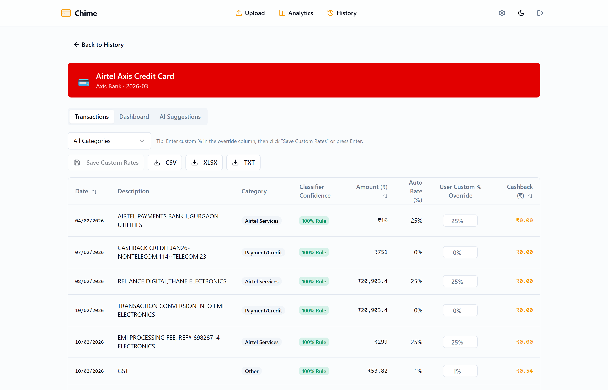
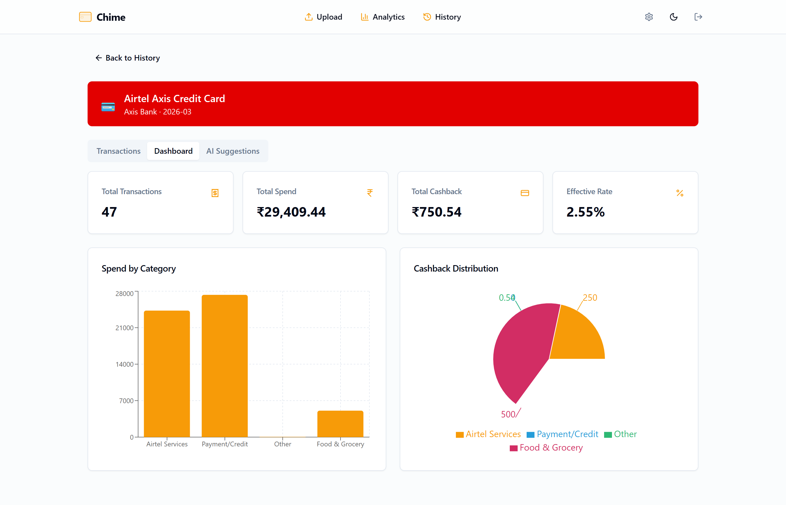
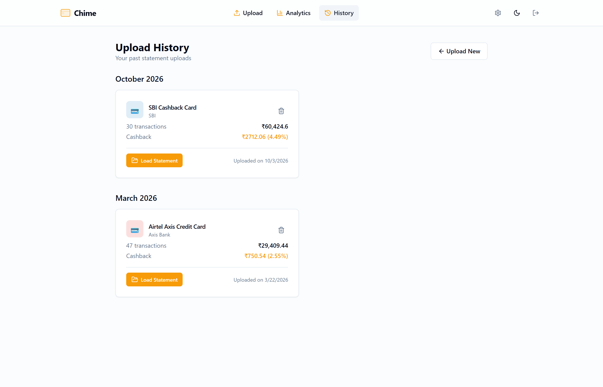
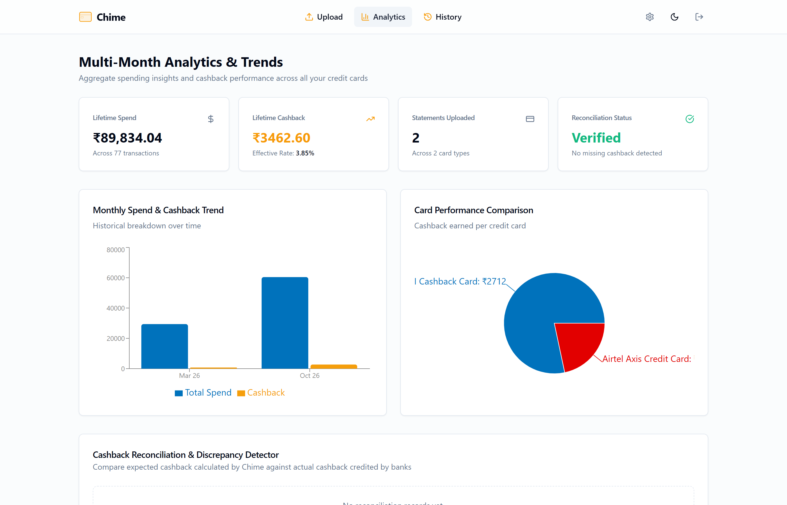
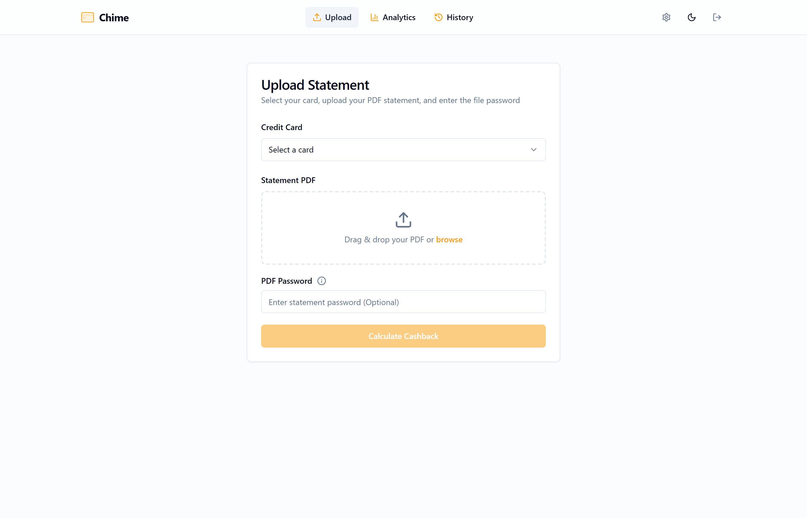

# Chime

Chime is a local-first desktop and web app for tracking and verifying credit card cashback from Indian bank statements.

Banks frequently alter reward terms, cap categories, or delay reward credits. Manually calculating whether you actually got the 5% or 10% advertised rate on every Swiggy, Amazon, or utility transaction across multiple pages of PDFs is frustrating. Chime parses your statements, classifies every transaction, computes the exact expected cashback according to your card's rules, and lets you reconcile it against what the bank actually credited.

Everything runs entirely on your own computer. Your statements and financial numbers never touch an external cloud server.

---

## Visual Overview & Screenshots

Chime features a clean, responsive desktop and web user interface built with React, Tailwind CSS, and Shadcn UI:

### 1. Statement Analysis & Transactions Table
Audit individual transactions, review rule-based classifier confidence badges, enter custom cashback rates, and save persistent overrides directly to your local SQLite database:



### 2. Statement Cashback Dashboard & Category Breakdown
Visualize monthly spend distribution and cashback earnings across shopping, dining, utilities, and telecom categories:



### 3. Historical Uploads & One-Click Statement Reloading
All uploaded statements are grouped by billing month with instant summary metrics. Click **Load Statement** to reload full transaction breakdowns and saved custom rates at any time:



### 4. Multi-Month Analytics & Trends
Track lifetime spend, cumulative cashback earnings, multi-month spending trends, and bank reconciliation variance in one unified dashboard:



### 5. Statement Ingestion & PDF Upload
Select your credit card, drag-and-drop encrypted or unencrypted PDF statements, and parse transactions locally in seconds:



---

## Architectural Decisions and Tradeoffs

When building Chime, we made several deliberate engineering choices to keep the project practical, secure, and easy to maintain.

### 1. Local-First by Design
* **Decision**: All PDF parsing, classification, calculations, and database storage run locally on localhost.
* **Why**: Credit card statements contain sensitive personal information (card numbers, full billing addresses, detailed spending history). Asking users to upload financial statements to a remote server creates trust and liability issues. By running everything locally, your data remains completely private.

### 2. Tauri v2 Desktop Wrapper Instead of Electron
* **Decision**: We use Tauri v2 with OS webview runtimes (WebView2 on Windows, WebKit on macOS/Linux) rather than Electron.
* **Why**: Electron ships a bundled copy of Chromium and Node.js with every app, regularly resulting in 200 MB to 400 MB installers and heavy memory overhead. Tauri provides a native OS window with a lightweight (~5 MB) shell that talks to our web frontend and backend process with minimal resource consumption.

### 3. Python Sidecar Instead of a Full Rust Port
* **Decision**: Keep the backend in Python (FastAPI frozen via PyInstaller into a native sidecar binary) rather than rewriting the backend in Rust.
* **Why**:
  * **Ecosystem match**: Python has best-in-class libraries for statement extraction (`pdfplumber`) and local embedding models (`sentence-transformers`). The Rust equivalents for parsing arbitrary, messy Indian bank statement formats are significantly less mature.
  * **Diminishing returns**: Processing a monthly statement takes 1 to 2 seconds. Reducing that to 0.05 seconds in Rust does not meaningfully improve user experience for a once-a-month operation.
  * **Maintainability**: New bank statement layouts and regex parsers can be written and tested rapidly in Python without complex Rust compile cycles.

### 4. Two-Layer Zero-Shot Classifier
* **Decision**: Use a fast deterministic keyword layer first, backed by a local Sentence-Transformers model as a fallback.
* **Why**:
  * **Zero API keys needed**: Users do not need an OpenAI or Anthropic API key to classify purchases.
  * **Predictable & editable**: 95%+ of typical transactions (Amazon, Flipkart, Swiggy, Uber, Zomato, petrol pumps) match clear patterns. These are declared in `keyword_rules.yaml` where anyone can inspect or add new merchants without touching code.
  * **Smart fallback**: For unlisted or oddly named merchants, the local embedding model (`all-MiniLM-L6-v2`) compares cosine similarity against card reward categories offline.

### 5. Remote Card Sync via GitHub
* **Decision**: Sync `cards.yaml` and `keyword_rules.yaml` from GitHub with automatic fallback to bundled local definitions.
* **Why**: Indian credit card reward structures change regularly. Banks frequently devalue cards, add exclusions (like rent or utility caps), or introduce new merchant partnerships. Instead of requiring users to install a whole new desktop application release just because a reward cap changed, Chime checks GitHub for updated YAML rule files on launch, while continuing to work seamlessly offline if there is no internet connection.

### 6. Data Durability in System AppData
* **Decision**: Store the user SQLite database in the OS standard data directory (`%APPDATA%/Chime/data/chime.db` on Windows, standard application directories on macOS and Linux) rather than the executable directory.
* **Why**: In packaged desktop applications or auto-updating binaries, storing database files in the installation folder risks data loss when the binary is replaced or cleaned up. Storing it in user AppData ensures transactions, custom overrides, and account history persist across updates.

### 7. Modular Calculation Engines (`backend/cashback_calculation/`)
* **Decision**: Decompose cashback calculations into dedicated card-specific calculation modules (`airtel_axis.py`, `standard.py`, `base.py`).
* **Why**: Cards like Airtel Axis use dynamic cap multipliers (such as 25% on Airtel capped at 2x base 1% spend, 10% utilities capped at 1x base 1% spend, and fixed partner caps), whereas cards like SBI Cashback and HDFC Swiggy use fixed monthly caps. Combining dynamic and fixed rules in a single file introduces tight coupling and makes regression testing difficult. Separating them keeps each card's logic isolated, testable, and clean.

### 8. Zero-PDF Persistence (Structured Data Only)
* **Decision**: We extract and store transaction records into SQLite during upload, and discard the raw temporary PDF file immediately.
* **Why**: Password-protected bank statements contain highly sensitive personally identifiable information. Retaining copies of PDFs on disk creates security liabilities. By saving only normalized transaction tables (`uploads` and `transactions`), statements load instantaneously with a single database query while keeping user files private.

### 9. Persistent Custom Value Overrides in SQLite
* **Decision**: Enable users to override cashback % rates per transaction directly from the UI, persisting these overrides and recalculated totals into SQLite via an explicit Save Custom Rates action.
* **Why**: Bank statement descriptions can sometimes miss merchant tags, or cardholders may receive temporary promotional cashback from special campaigns. Rather than keeping overrides only in browser memory, Chime provides an explicit Save Custom Rates button that updates the database, recalculates total statement cashback and effective rate, and immediately synchronizes historical upload cards.

---

## Documentation & Wiki

For in-depth architecture, calculation formulas, parser guides, and troubleshooting:
* **[wiki/README.md](wiki/README.md)**: Master documentation index and reading order.
* **[01. Architecture & Design](wiki/01-architecture-and-design.md)**: System design, local-first philosophy, and data flow.
* **[02. Database Schema & Storage](wiki/02-database-schema-and-storage.md)**: SQLite schema, tables, foreign keys, and override persistence.
* **[03. Statement Parsers](wiki/03-parsers-and-statement-ingestion.md)**: Bank statement formats, regex patterns, and adding new parsers.
* **[04. Classification Engine](wiki/04-transaction-classification-engine.md)**: Two-layer zero-shot classification engine.
* **[05. Cashback Engines](wiki/05-cashback-calculation-engines.md)**: Card engines, Airtel Axis dynamic caps, and tiered limits.
* **[06. Frontend & UI Architecture](wiki/06-frontend-and-ui-architecture.md)**: React components, state management, and real-time syncing.
* **[07. Desktop Packaging & Tauri](wiki/07-desktop-packaging-and-tauri.md)**: Native installers, PyInstaller sidecar, and timestamp tracking.
* **[08. Setup & Troubleshooting](wiki/08-setup-development-and-troubleshooting.md)**: Development setup, test runners, and common fixes.

---

## Tech Stack

| Layer | Technologies |
|---|---|
| **Desktop Shell** | Tauri v2, Rust 1.90+, `@tauri-apps/plugin-shell` |
| **Frontend** | React 18, Vite, TypeScript, Tailwind CSS, Shadcn UI, Recharts, Lucide Icons |
| **Backend** | Python 3.10+, FastAPI, Uvicorn, SQLite, PyInstaller |
| **Parsing & ML** | pdfplumber, sentence-transformers, PyYAML |
| **Environment** | Managed via `uv` (Python) and `npm` (Node.js) |

---

## Supported Credit Cards

Chime includes tailored rule configurations and parsers for popular Indian cashback cards:

* **SBI Cashback**: 5% online shopping (capped at 5,000 INR/month), 1% offline, exclusions for fuel, utility, wallet, school fees.
* **Axis Airtel**: Updated reward rules: 25% on Airtel services (dynamic cap of 2x base 1% spend), 10% on utilities via Airtel Thanks (dynamic cap of 1x base 1% spend), 10% on food and grocery partners like Zomato, Blinkit, and District Movies (capped at 200 INR/month), and 1% base unlimited cashback on other spends.
* **HDFC Swiggy**: 10% Swiggy ecosystem (Food, Instamart, Dineout, capped at 1,500 INR/month), 5% selected online platforms (capped at 1,500 INR/month), 1% other spends.

Adding a new credit card does not require altering backend logic. Add the card definition and reward tiers to `backend/cards.yaml` and keyword mapping to `backend/keyword_rules.yaml`.

---

## AI Assistant & Interactive Prompts

Chime includes an offline AI Assistant in the statement dashboard to help you analyze your spends and discover optimization opportunities:

* **Instant Insight Summary**: Automatically summarizes top spending categories, highest cashback categories, and effective reward rate upon loading.
* **Interactive Quick Prompt Chips**: Clickable prompt chips allow quick one-tap queries without manual typing:
  * *"What is my total spend?"*: Instant spend breakdown across all transactions.
  * *"What is my total cashback?"*: Exact expected returns and effective cashback percentage.
  * *"What was my biggest purchase?"*: Highlights the largest merchant charge and its cashback yield.
  * *"Category breakdown"*: Formatted bullet list comparing spending across each category.
  * *"How can I maximize my cashback?"*: Actionable recommendations on shifting low-reward spends to specialized cards.

---

## Getting Started

### Prerequisites

* **Node.js** v18+ and **npm**
* **Python** 3.10+ and [uv](https://github.com/astral-sh/uv) (`pip install uv`)
* **Rust** stable (only needed if building or running the Tauri desktop app)

---

### Running in Desktop Mode (Tauri)

To launch the desktop app locally:

```powershell
# Windows
.\Scripts\tauri-dev.ps1

# Or manually from frontend/
cd frontend
npm run tauri dev
```

This launches the native desktop window and automatically starts the local Python backend sidecar.

---

### Running in Web Dev Mode (Browser)

If you prefer developing in a standard web browser:

```powershell
# Windows (launches frontend and backend in separate terminals)
.\Scripts\dev.ps1

# Linux / macOS
./Scripts/dev.sh
```

* Frontend: `http://localhost:8080` (proxies `/api` to the backend)
* Backend API: `http://localhost:8000` (FastAPI interactive docs at `/docs`)

---

---

## Download Pre-built Installers

For users who want to run Chime directly without installing Python, Node.js, or Rust, standalone installers and detailed release notes are published on the **[GitHub Releases Page](https://github.com/SanjayShetty01/Chime/releases)**.

Download the latest version directly from **[Releases (Latest)](https://github.com/SanjayShetty01/Chime/releases/latest)**:

| Operating System | Package Format | Installer File |
|---|---|---|
| **Windows** | `.exe` (NSIS) | [Chime_1.0.0_x64-setup.exe](https://github.com/SanjayShetty01/Chime/releases/latest) (Recommended setup installer) |
| **Windows** | `.msi` (MSI Installer) | [Chime_1.0.0_x64_en-US.msi](https://github.com/SanjayShetty01/Chime/releases/latest) (Silent enterprise deploy) |
| **Linux (Ubuntu / Debian)** | `.deb` | [chime_1.0.0_amd64.deb](https://github.com/SanjayShetty01/Chime/releases/latest) (`sudo dpkg -i chime_1.0.0_amd64.deb`) |
| **Linux (Fedora / RHEL)** | `.rpm` | [chime-1.0.0-1.x86_64.rpm](https://github.com/SanjayShetty01/Chime/releases/latest) (`sudo dnf install chime-1.0.0-1.x86_64.rpm`) |
| **Linux (Universal)** | `.AppImage` | [chime_1.0.0_amd64.AppImage](https://github.com/SanjayShetty01/Chime/releases/latest) (Portable, runs on any Linux distro) |
| **macOS** | `.dmg` | [Chime_1.0.0_x64.dmg](https://github.com/SanjayShetty01/Chime/releases/latest) / [Chime_1.0.0_aarch64.dmg](https://github.com/SanjayShetty01/Chime/releases/latest) (Apple Silicon & Intel) |

Each bundle includes the complete application: the lightweight user interface, the frozen Python calculation engine, and embedded card rules. No external runtime or cloud connection is required.

Check the **[Release Notes](https://github.com/SanjayShetty01/Chime/releases)** for detailed changelogs, sha256 checksums, and version history.

---

### Building Installers from Source

To package the standalone installers yourself for your current platform:

```powershell
# Windows (.exe installer + .msi)
.\Scripts\tauri-build.ps1

# Or via npm from the frontend folder
cd frontend
npm run tauri build
```

```bash
# Linux (.deb, .rpm, .AppImage) or macOS (.dmg)
cd frontend
npm run tauri build
```

Compiled packages are placed in:

* **Windows Setup (.exe)**: `frontend/src-tauri/target/release/bundle/nsis/`
* **Windows MSI (.msi)**: `frontend/src-tauri/target/release/bundle/msi/`
* **Debian / Ubuntu (.deb)**: `frontend/src-tauri/target/release/bundle/deb/`
* **Fedora / RHEL (.rpm)**: `frontend/src-tauri/target/release/bundle/rpm/`
* **Portable Linux (.AppImage)**: `frontend/src-tauri/target/release/bundle/appimage/`
* **macOS Disk Image (.dmg)**: `frontend/src-tauri/target/release/bundle/dmg/`

---

## Testing

```bash
# Frontend type check & build validation
cd frontend
npm run build

# Backend classification tests (35 test cases)
cd backend
uv run python test_classifier.py
```

---

## License

MIT License. See [LICENSE](LICENSE) for details.
